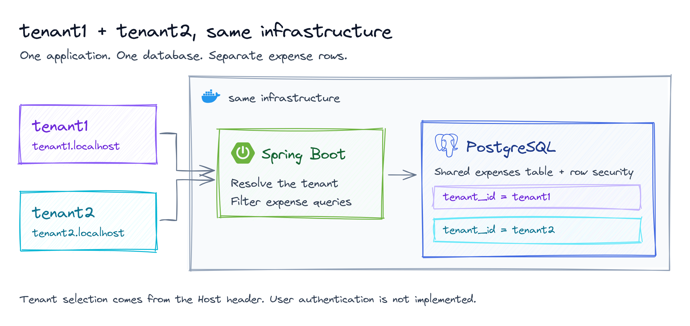
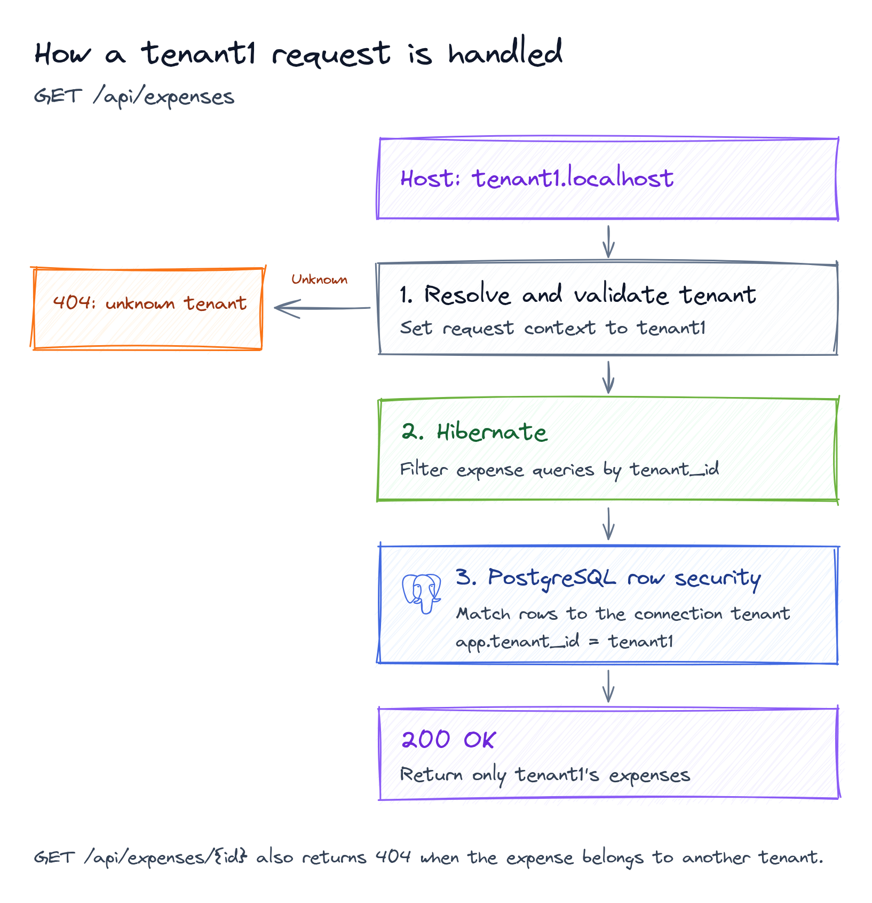

# Multitenancy Expense Tracker

[](https://github.com/anqorithm/multitenancy-expense-tracker/actions/workflows/ci.yml)
[](https://docs.oracle.com/en/java/javase/27/)
[](https://spring.io/projects/spring-boot)
[](https://www.postgresql.org/docs/16/)
[](https://docs.docker.com/compose/)

An expense tracker where **tenant1** and **tenant2** share the **same infrastructure**: one app and one database. Each tenant sees only its own expenses.

Built with **Spring Boot 4.1.1**, **Java 27**, and **PostgreSQL 16**.



## Run it

You need Docker Compose, `make`, and `curl`. The API walkthrough also needs `jq` or Python 3.

```bash
make up
make demo
```

The app runs on port `8080`. The API walkthrough shows both tenants' expenses, adds an expense, and checks that tenant1 cannot read tenant2's data.

## Try it

```bash
curl -H "Host: tenant1.localhost" http://localhost:8080/api/expenses
curl -H "Host: tenant2.localhost" http://localhost:8080/api/expenses
```

Only the `Host` header changes. Each request returns a different tenant's expenses.

You can also run the requests in [demo.http](demo.http) from IntelliJ IDEA.

## How it works

A **tenant** is a separate account using the shared app, such as `tenant1` or `tenant2`.

1. The app reads the tenant ID from the subdomain, such as `tenant1.localhost`.
2. Hibernate assigns a `tenant_id` to each new expense and filters expense queries by tenant.
3. PostgreSQL row-level security adds a database check, so even raw SQL only sees the selected tenant's rows.

For a request from `tenant1`, the flow looks like this:



The app currently has no login. Anyone can select either tenant through the `Host` header. Before using it with real users, add a check that the signed-in user belongs to the selected tenant.

## API examples

All `/api` endpoints use the tenant in the `Host` header. These responses start from a fresh database; IDs and totals change as you add expenses. Expand a scenario to see its request and response.

| Method | Endpoint | Purpose |
|--------|----------|---------|
| GET | `/api/me` | Show the selected tenant |
| GET | `/api/expenses` | List the selected tenant's expenses |
| GET | `/api/expenses/total` | Count and total the tenant's expenses |
| GET | `/api/expenses/{id}` | Read one expense belonging to the tenant |
| POST | `/api/expenses` | Add an expense for the tenant |
| GET | `/api/debug/leak-test` | Check raw SQL isolation |
| GET | `/actuator/health` | Check app health without selecting a tenant |

<details>
<summary>Tenant identity: tenant1</summary>

```bash
curl -i -H "Host: tenant1.localhost" \
  http://localhost:8080/api/me
```

Response: `200`

```json
{
  "tenantId": "tenant1",
  "name": "Tenant One Inc"
}
```

</details>

<details>
<summary>Tenant identity: tenant2</summary>

```bash
curl -i -H "Host: tenant2.localhost" \
  http://localhost:8080/api/me
```

Response: `200`

```json
{
  "tenantId": "tenant2",
  "name": "Tenant Two Ltd"
}
```

</details>

<details>
<summary>List expenses: tenant1</summary>

```bash
curl -i -H "Host: tenant1.localhost" \
  http://localhost:8080/api/expenses
```

Response: `200`

```json
[
  {
    "id": 1,
    "tenantId": "tenant1",
    "description": "Office rent",
    "amount": 5000.0,
    "spentOn": "2026-09-01"
  },
  {
    "id": 2,
    "tenantId": "tenant1",
    "description": "Laptops",
    "amount": 12000.0,
    "spentOn": "2026-09-05"
  },
  {
    "id": 3,
    "tenantId": "tenant1",
    "description": "Coffee",
    "amount": 150.0,
    "spentOn": "2026-09-10"
  }
]
```

</details>

<details>
<summary>Same infrastructure, different rows: tenant2</summary>

```bash
curl -i -H "Host: tenant2.localhost" \
  http://localhost:8080/api/expenses
```

Response: `200`

```json
[
  {
    "id": 4,
    "tenantId": "tenant2",
    "description": "Truck fuel",
    "amount": 800.0,
    "spentOn": "2026-09-03"
  },
  {
    "id": 5,
    "tenantId": "tenant2",
    "description": "Warehouse rent",
    "amount": 2300.0,
    "spentOn": "2026-09-08"
  }
]
```

</details>

<details>
<summary>Expense totals: tenant1</summary>

```bash
curl -i -H "Host: tenant1.localhost" \
  http://localhost:8080/api/expenses/total
```

Response: `200`

```json
{
  "tenantId": "tenant1",
  "count": 3,
  "total": 17150.0
}
```

</details>

<details>
<summary>Expense totals: tenant2</summary>

```bash
curl -i -H "Host: tenant2.localhost" \
  http://localhost:8080/api/expenses/total
```

Response: `200`

```json
{
  "tenantId": "tenant2",
  "count": 2,
  "total": 3100.0
}
```

</details>

<details>
<summary>Read an expense owned by tenant1</summary>

```bash
curl -i -H "Host: tenant1.localhost" \
  http://localhost:8080/api/expenses/1
```

Response: `200`

```json
{
  "id": 1,
  "tenantId": "tenant1",
  "description": "Office rent",
  "amount": 5000.0,
  "spentOn": "2026-09-01"
}
```

</details>

<details>
<summary>Tenant2 tries to read tenant1’s expense</summary>

```bash
curl -i -H "Host: tenant2.localhost" \
  http://localhost:8080/api/expenses/1
```

Response: `404`

```json
{
  "error": "not found",
  "detail": "expense 1 not found"
}
```

</details>

<details>
<summary>Expense ID does not exist</summary>

```bash
curl -i -H "Host: tenant1.localhost" \
  http://localhost:8080/api/expenses/999999
```

Response: `404`

```json
{
  "error": "not found",
  "detail": "expense 999999 not found"
}
```

</details>

<details>
<summary>Raw SQL returns only tenant1’s rows</summary>

```bash
curl -i -H "Host: tenant1.localhost" \
  http://localhost:8080/api/debug/leak-test
```

Response: `200`

```json
{
  "sql": "select count(*), coalesce(sum(amount), 0) from expenses",
  "postgresSessionTenant": "tenant1",
  "sumVisible": 17150.0,
  "tenantId": "tenant1",
  "rowsVisible": 3
}
```

</details>

<details>
<summary>The same raw SQL returns only tenant2’s rows</summary>

```bash
curl -i -H "Host: tenant2.localhost" \
  http://localhost:8080/api/debug/leak-test
```

Response: `200`

```json
{
  "sql": "select count(*), coalesce(sum(amount), 0) from expenses",
  "postgresSessionTenant": "tenant2",
  "sumVisible": 3100.0,
  "tenantId": "tenant2",
  "rowsVisible": 2
}
```

</details>

<details>
<summary>Unknown tenant</summary>

```bash
curl -i -H "Host: nobody.localhost" \
  http://localhost:8080/api/expenses
```

Response: `404`

```json
{
  "error": "unknown tenant",
  "host": "nobody.localhost"
}
```

</details>

<details>
<summary>Missing tenant subdomain</summary>

```bash
curl -i -H "Host: localhost" \
  http://localhost:8080/api/expenses
```

Response: `404`

```json
{
  "error": "unknown tenant",
  "host": "localhost"
}
```

</details>

<details>
<summary>Create an expense with missing required fields</summary>

```bash
curl -i -X POST -H "Host: tenant1.localhost" \
  -H "Content-Type: application/json" \
  -d '{}' \
  http://localhost:8080/api/expenses
```

Response: `400`

```json
{
  "error": "bad request",
  "detail": "description, amount and spentOn are required"
}
```

</details>

<details>
<summary>Create an expense for tenant1</summary>

```bash
curl -i -X POST -H "Host: tenant1.localhost" \
  -H "Content-Type: application/json" \
  -d '{"description":"Printer","amount":400,"spentOn":"2026-09-21"}' \
  http://localhost:8080/api/expenses
```

Response: `201`

```json
{
  "id": 6,
  "tenantId": "tenant1",
  "description": "Printer",
  "amount": 400,
  "spentOn": "2026-09-21"
}
```

</details>

<details>
<summary>Tenant2’s total stays the same after tenant1 adds an expense</summary>

```bash
curl -i -H "Host: tenant2.localhost" \
  http://localhost:8080/api/expenses/total
```

Response: `200`

```json
{
  "tenantId": "tenant2",
  "count": 2,
  "total": 3100.0
}
```

</details>

<details>
<summary>Health check without a tenant</summary>

```bash
curl -i \
  http://localhost:8080/actuator/health
```

Response: `200`

```json
{
  "groups": [
    "liveness",
    "readiness"
  ],
  "status": "UP"
}
```

</details>

## Useful commands

| Command | What it does |
|---------|--------------|
| `make logs` | Show app logs and SQL queries |
| `make psql` | Open the database as an administrator who can see all tenants |
| `python3 scripts/smoke-test.py` | Check tenant isolation; adds one test expense |
| `make down` | Stop the app and delete its database data |

If you used the earlier version, SQL comment changes affect Flyway checksums. For disposable local data, run `make down` and `make up` to start fresh. Save any data you need first.

The build and isolation checks pass on Java 27. Spring Boot's [published compatibility range](https://docs.spring.io/spring-boot/system-requirements.html) currently ends at Java 26.

## CI and releases

[GitHub Actions](.github/workflows/ci.yml) builds the app and checks tenant isolation on pushes and pull requests. Push a tag matching the version in `pom.xml`, such as `v0.1.0`, to publish the tested JAR and its checksum as a GitHub release.

Run the same build and isolation checks locally with `bash scripts/ci-check.sh`. To release version `0.1.0`, push the matching commit, then run `git tag v0.1.0` and `git push origin v0.1.0`.

## Learn more

These resources explain the design:

- [Multitenant storage patterns](https://learn.microsoft.com/en-us/azure/architecture/guide/multitenant/approaches/storage-data): shared databases compared with separate storage for each tenant.
- [Hibernate tenant IDs](https://docs.hibernate.org/orm/7.1/javadocs/org/hibernate/annotations/TenantId.html): how `@TenantId` assigns ownership.
- [PostgreSQL row-level security](https://www.postgresql.org/docs/16/ddl-rowsecurity.html): how the database filters rows.
